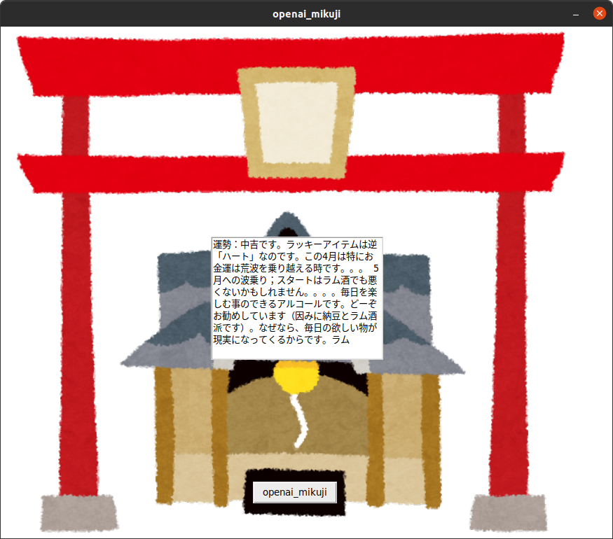

# KUS-Omikuji-GPT3
クソみくじの2021版です。GPT-3を使用する関係上、OpenAIのAPIキーが必須になります。



```bash
git clone https://github.com/Ar-Ray-code/KUS-Omikuji-GPT-3.git
cd KUS-Omikuji-GPT-3
vim main.py # main.pyにOpenAIのAPIキーを記入する。
python3 main.py
```

## 運勢

大吉〜大凶までの7段階が疑似乱数によって等しい確率で選ばれます。

## ラッキーアイテム

GPT-3によって生成されます。面白いラッキーアイテムの説明文をお楽しみください。現時点では200文字を限度に文字を生成します。
